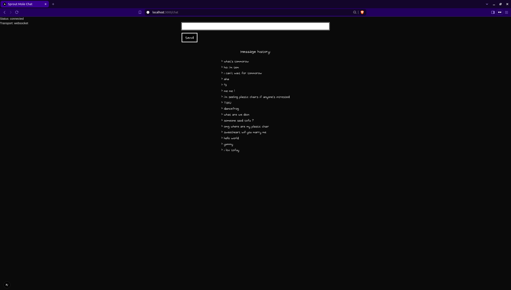
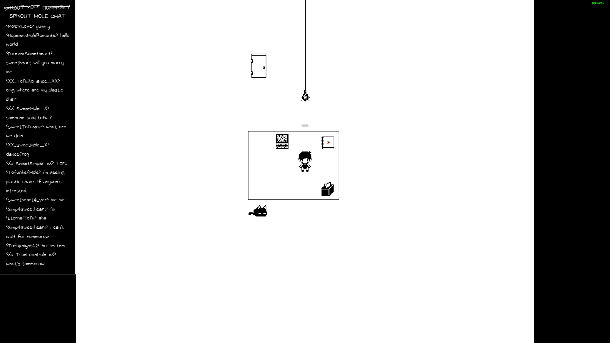

# Sprout Mole chat

Inspired by the game Omori and made for restrained usage with friends. This app uses a custom node.js server with NextJS and Socket.io to emulate a private livestream chat.

## Usage

First, run the development server:

```bash
npm run dev
```

For the chat side: [http://localhost:3000/chat](http://localhost:3000/chat)


For the render side: [http://localhost:3000/render](http://localhost:3000/render)

## Pages

### /chat 

This page is for the user that wish to send messages to the chat. It also contain a simple chat history.

### /render

This page displays a render in the style of the game Omori. The user can choose to either display the last message sent like it was a dialogue with a npc. Or a more conventional 'streamer chat' looking render of all last sent messages.  

This page also include a choice of 'theme', the choices impact minor graphic element as well as changing the pool from wich the randomly chosen username are picked.

Due to an oversight made while coding it is recommanded to have a 90% zoom on this page ;)

## Preview

Chatter POV:



Render of the chat with OBS:



